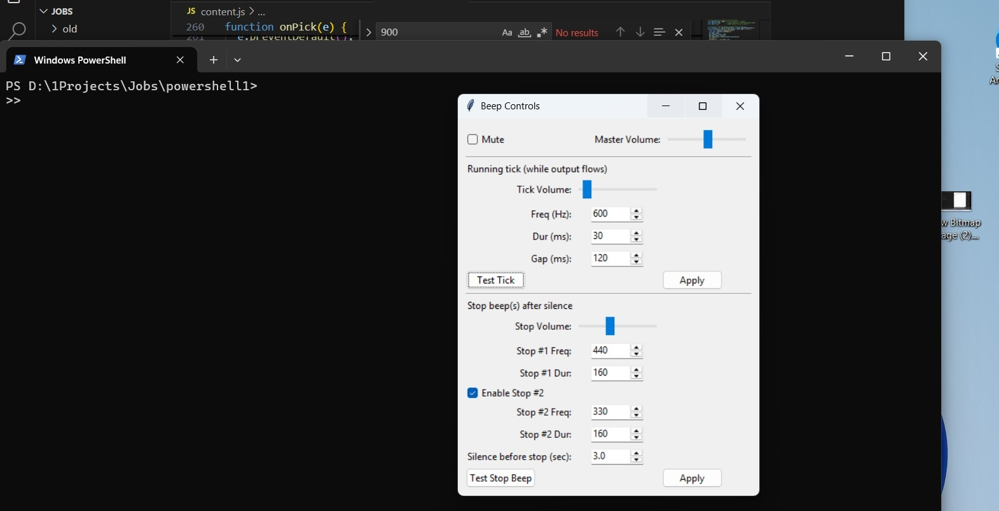
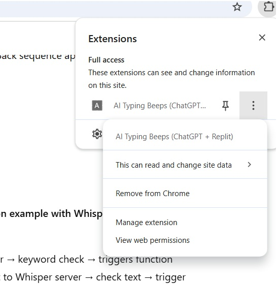

# Jobs
BH

This is a program that plays sounds for the Powershell Chat GPT, and Replit to notify the User for inactivity and activity inside these programs weather the window is on the screen or minimized or in another desktop. This is so a person doesn't have to be stuck waiting on one screen and can go freely on different screens and can be confident that when what ever is working in the background is done it will make as sound and they can easily come back to finish what ever needs to be done. With G-ds help soon for the Linux and Mac OS Shell as well.

To load the chrome extention go to 
chrome://extensions/
then press load unpacked and add the Jobs folder and that should load the extetions you just have to pin it and your good!! 

<strong>PowerShell</strong>

<strong>Chrome Extention</strong>

